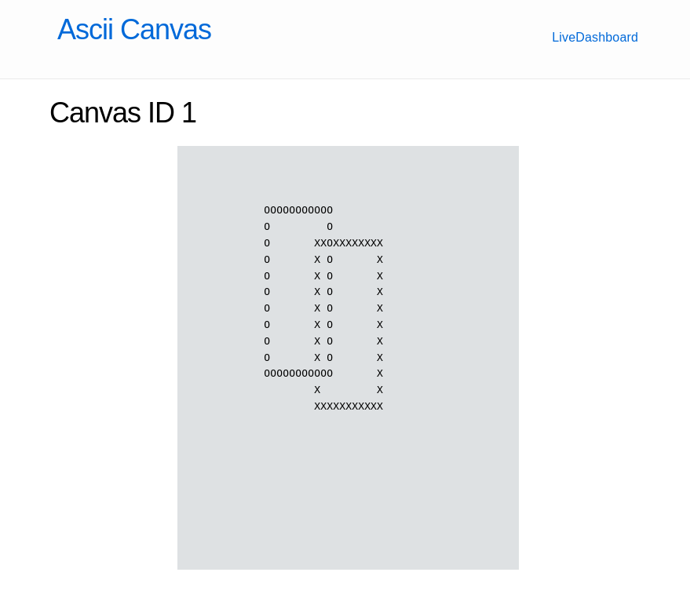

  <h1 align="center">
    ASCII Canvas
  </h1>

> An Elixir + PhoenixLiveView application to make ASCII art drawing on a 50x25 canvas
> - [Server Drawing Endpoints API](https://github.com/tarekcampossaleh/ascii-canvas/blob/main/README.md#routes)
> - [Read-Only Client (live-view)](https://github.com/tarekcampossaleh/ascii-canvas/blob/main/README.md#read-only-client-live-view)


To start your Phoenix server:

  * Install dependencies with `mix deps.get`
  * Create and migrate your database with `mix ecto.setup`
  * Start Phoenix endpoint with `mix phx.server` or inside IEx with `iex -S mix phx.server`
  * Run tests with `mix test`

Now you can visit [`localhost:4000`](http://localhost:4000) from your browser, and make http requests to `localhost:4000/canvas` to perform drawing operations

Once populated, you can live-view the canvas by accessing the `localhost:4000/canvas/id` where `id` is a query param that references an existing canvas_id

## API Instructions

### For Drawing operations, we have the following options:

- *Rectangle*, parameterized with:
   -  `id` - Globally unique identifier, `integer`, used for selecting the canvas drawing target. If the requested id doesn't exist, a blank 50x25 canvas with the next available id is created.
   -  `width` - A `integer`, used for expressing the width size of the drawing
   -  `height` - A `integer`, used for expressing the height size of the drawing
   -  `x` - A `integer`, used for defining the upper-left corner x-axis from 0 to 50
   -  `y` - A `integer`, used for defining the upper-left corner y-axis from 0 to 25
   -  `outline_char` A `ASCII utf-8 char` used for defining the outline character. In case of `none`, assign the value `""`
   -  `fill_char` A `ASCII utf-8 char` used for defining the fill character. In case of `none`, assign the value `""`


- *Flood_fill*, parameterised with:
   -  `id` - Globally unique identifier, `integer`, used for selecting the canvas drawing target. If the requested id doesn't exist, a blank 50x25 canvas with the next available id is created.
   -  `x` - A `integer`, used for defining the upper-left corner x-axis from 0 to 50
   -  `y` - A `integer`, used for defining the upper-left corner y-axis from 0 to 25
   -  `fill_char` A `ASCII utf-8 char` used for defining the flood fill character.

## Routes

### Drawing a rectangle:

*Request:*

```css
POST /canvas
```
*Body:*

```json
{
   "rectangle":{
      "id":1,
      "width":10,
      "height":10,
      "x":20,
      "y":8,
      "outline_char":"X",
      "fill_char":""
   }
}
```
*Response:*

```json
{
  "data": {
    "canvas": [
      "                                                  ",
      "                                                  ",
      "                                                  ",
      "                                                  ",
      "                                                  ",
      "                                                  ",
      "                                                  ",
      "                                                  ",
      "                    XXXXXXXXXXX                   ",
      "                    X         X                   ",
      "                    X         X                   ",
      "                    X         X                   ",
      "                    X         X                   ",
      "                    X         X                   ",
      "                    X         X                   ",
      "                    X         X                   ",
      "                    X         X                   ",
      "                    X         X                   ",
      "                    XXXXXXXXXXX                   ",
      "                                                  ",
      "                                                  ",
      "                                                  ",
      "                                                  ",
      "                                                  ",
      "                                                  "
    ],
    "canvas_id": 1
  }
}
```

Meshing a rectangle:

*Request:*

```css
POST /canvas
```
*Body:*

```json
{
   "rectangle":{
      "id":1,
      "width":10,
      "height":10,
      "x":12,
      "y":3,
      "outline_char":"O",
      "fill_char":""
   }
}
```
*Response:*
```json
{
  "data": {
    "canvas": [
      "                                                  ",
      "                                                  ",
      "                                                  ",
      "            OOOOOOOOOOO                           ",
      "            O         O                           ",
      "            O       XXOXXXXXXXX                   ",
      "            O       X O       X                   ",
      "            O       X O       X                   ",
      "            O       X O       X                   ",
      "            O       X O       X                   ",
      "            O       X O       X                   ",
      "            O       X O       X                   ",
      "            O       X O       X                   ",
      "            OOOOOOOOOOO       X                   ",
      "                    X         X                   ",
      "                    XXXXXXXXXXX                   ",
      "                                                  ",
      "                                                  ",
      "                                                  ",
      "                                                  ",
      "                                                  ",
      "                                                  ",
      "                                                  ",
      "                                                  ",
      "                                                  "
    ],
    "canvas_id": 1
  }
}
```

### Drawing a flood fill:

*Request:*

```css
POST /canvas
```
*Body:*

```json
{
   "flood_fill":{
      "id":1,
      "x":5,
      "y":5,
      "fill_char":"x"
   }
}
```
*Response:*

```json
{
  "data": {
    "canvas": [
      "                                                  ",
      "                                                  ",
      "                                                  ",
      "                                                  ",
      "                                                  ",
      "     xxxxxxxxxxxxxxxxxxxxxxxxxxxxxxxxxxxxxxxxxxxxx",
      "     xxxxxxxxxxxxxxxxxxxxxxxxxxxxxxxxxxxxxxxxxxxxx",
      "     xxxxxxxxxxxxxxxxxxxxxxxxxxxxxxxxxxxxxxxxxxxxx",
      "     xxxxxxxxxxxxxxxxxxxxxxxxxxxxxxxxxxxxxxxxxxxxx",
      "     xxxxxxxxxxxxxxxxxxxxxxxxxxxxxxxxxxxxxxxxxxxxx",
      "     xxxxxxxxxxxxxxxxxxxxxxxxxxxxxxxxxxxxxxxxxxxxx",
      "     xxxxxxxxxxxxxxxxxxxxxxxxxxxxxxxxxxxxxxxxxxxxx",
      "     xxxxxxxxxxxxxxxxxxxxxxxxxxxxxxxxxxxxxxxxxxxxx",
      "     xxxxxxxxxxxxxxxxxxxxxxxxxxxxxxxxxxxxxxxxxxxxx",
      "     xxxxxxxxxxxxxxxxxxxxxxxxxxxxxxxxxxxxxxxxxxxxx",
      "     xxxxxxxxxxxxxxxxxxxxxxxxxxxxxxxxxxxxxxxxxxxxx",
      "     xxxxxxxxxxxxxxxxxxxxxxxxxxxxxxxxxxxxxxxxxxxxx",
      "     xxxxxxxxxxxxxxxxxxxxxxxxxxxxxxxxxxxxxxxxxxxxx",
      "     xxxxxxxxxxxxxxxxxxxxxxxxxxxxxxxxxxxxxxxxxxxxx",
      "     xxxxxxxxxxxxxxxxxxxxxxxxxxxxxxxxxxxxxxxxxxxxx",
      "     xxxxxxxxxxxxxxxxxxxxxxxxxxxxxxxxxxxxxxxxxxxxx",
      "     xxxxxxxxxxxxxxxxxxxxxxxxxxxxxxxxxxxxxxxxxxxxx",
      "     xxxxxxxxxxxxxxxxxxxxxxxxxxxxxxxxxxxxxxxxxxxxx",
      "     xxxxxxxxxxxxxxxxxxxxxxxxxxxxxxxxxxxxxxxxxxxxx",
      "     xxxxxxxxxxxxxxxxxxxxxxxxxxxxxxxxxxxxxxxxxxxxx"
    ],
    "canvas_id": 1
  }
}
```

### We also can create an empty 50x25 canvas by making a `post /canvas` with no body, e.g.

*Request:*

```css
POST /canvas
```
*Body:*

```json
{}
```
*Response:*
```json
{
  "data": {
    "canvas": [
      "                                                  ",
      "                                                  ",
      "                                                  ",
      "                                                  ",
      "                                                  ",
      "                                                  ",
      "                                                  ",
      "                                                  ",
      "                                                  ",
      "                                                  ",
      "                                                  ",
      "                                                  ",
      "                                                  ",
      "                                                  ",
      "                                                  ",
      "                                                  ",
      "                                                  ",
      "                                                  ",
      "                                                  ",
      "                                                  ",
      "                                                  ",
      "                                                  ",
      "                                                  ",
      "                                                  ",
      "                                                  "
    ],
    "canvas_id": 1,
    "message": "Canvas of id: 1 created"
  }
}
```

## Read-Only Client (live-view)
> To correctly render a canvas, it is necessary to pre-create a blank canvas, [follow this request](https://github.com/tarekcampossaleh/ascii-canvas/blob/main/README.md#routes) to perform that

```css
get /canvas/:id
``` 
if canvas_id = 1 

```css
get /canvas/1

 # or
 
http://localhost:4000/canvas/1
``` 

<p align="center">
 

<p/>
